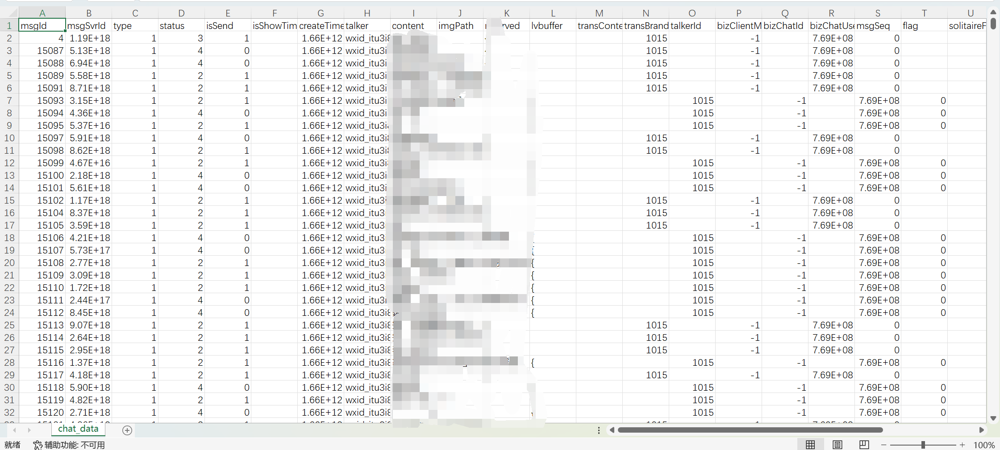
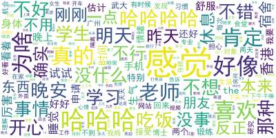
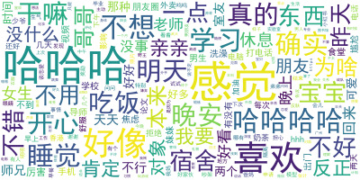
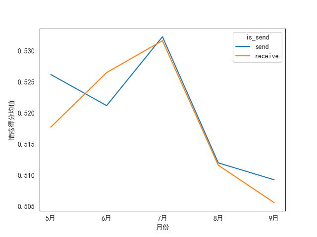
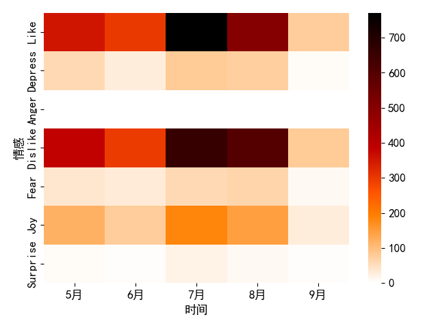
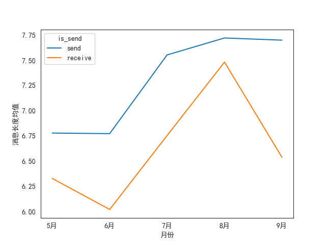

# 用python对微信聊天记录进行文本分析

## 项目结构、所需数据
    --data  存放分析所需的数据
        --EnMicroMsg.db     从微信中导出的聊天记录数据库
        --chat_data.csv     将数据库中的聊天记录存储到csv文件，之后分析都从csv读取数据
        --大连理工大学中文情感词汇本体.xlsx   情感词典
        --CNstopwords.txt   中文停用词
        --simhei.ttf        绘制词云指定的字体

    --result 存放分析结果、生成的图片
    
    --gernerate_word_cloud.py   生成词云
    
    --sentiment_snownlp.py      调用snownlp生成情感得分，计算情感均值、作折线图

    --sentiment_dict.py         使用大连理工情感词典计算情绪分类，作热力图
    
    --others.py                 其他统计
 

## 具体步骤
### 1. 导出聊天记录
    参考以下两个博客：
    ① https://blog.csdn.net/weixin_41746317/article/details/104110161?spm=1001.2101.3001.6650.5&utm_medium=distribute.pc_relevant.none-task-blog-2%7Edefault%7EOPENSEARCH%7ERate-5-104110161-blog-126700288.pc_relevant_multi_platform_whitelistv3&depth_1-utm_source=distribute.pc_relevant.none-task-blog-2%7Edefault%7EOPENSEARCH%7ERate-5-104110161-blog-126700288.pc_relevant_multi_platform_whitelistv3&utm_relevant_index=6
    ① https://blog.csdn.net/m0_59452630/article/details/124222235
    破译密码如果①的方法没成功可以试试②的

    content列：聊天内容
    type列：信息类型（1代表文本消息，需要用excel筛选一下之后只分析type=1的数据）
    isSend列：0代表对方发送的信息，1代表自己发送的信息
    createTime：时间（暂时不知道怎么恢复成年月日），但是降序排序以后的顺序是聊天记录由近到远的顺序
    自己加了一列newTime，记录聊天记录所在月份，是根据createTime降序排序后，手机上看每月最后几句信息，在excel中搜索，来进行月份划分的
    
   
    
    
### 2. 生成词云
    调用generate_word_cloud.py
   
   

### 3. 计算情感得分均值，作折线图（使用snownlp）
    ① 调用get_sentiment_score()函数，将情感得分保存到csv的sentiment_score列中
    ② 调用draw()函数，将情感得分随时间变化值保存到result文件夹中
    
    snownlp得到的分值不一定准确，所以send和receive的得分值都差不多，但也有可能日常的交流就是比较中性的，没有什么大起大落的情感
   

### 4. 计算情绪分类，作热力图（使用大连理工情感词典）
    调用sentiment_dict.py
    注意第115行，如果没有匹配到任何情感词，就记为None，绘制热力图的时候会筛掉None的记录
   

### 5. 其他统计绘图
    others.py
   

    
    
    

